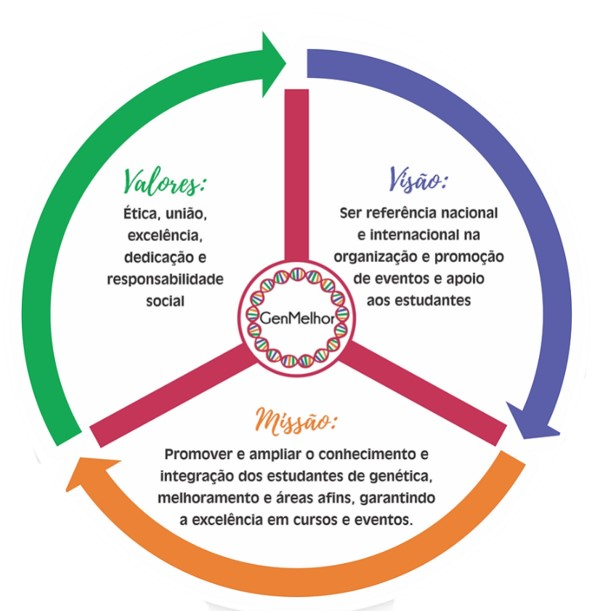

## About Us

O Grupo de Estudos em Genética e Melhoramento da Universidade Federal de Viçosa (GenMelhor) foi criado em outubro de 2005, por meio da iniciativa conjunta entre professores e estudantes do Programa de Pós-graduação em Genética e Melhoramento da UFV. Desde sua criação, o GenMelhor tem-se comprometido com a promoção de cursos, workshops, simpósios e demais eventos que possam contribuir com difusão de novos conhecimentos, ferramentas e tecnologias aplicadas a genética e melhoramento. Além disso, o GenMelhor têm proporcionado maior interação entre professores, estudantes e profissionais do setor público e privado, permitindo assim maior troca de informações e experiências na área de Genética e Melhoramento. 

